# 🐜 Pest Control Reporting System – Takween Al Watan

A full-stack web application built to digitize and streamline pest control field reporting for a Saudi company working on government projects in Makkah. The system enables 10+ field workers to submit structured inspection data and provides administrators with a secure dashboard to manage, analyze, and export reports in dynamic Excel formats. The platform improved data accuracy, eliminated 100% of manual tracking, and reduced daily processing time by over 60%.

---

## 🔧 Features

### 👷‍♂️ Field Worker Interface (No Login)

- Smart Arabic RTL form for submitting daily field reports
- Fields include date, municipality, district, treatment type, trap data, and site categories
- Submissions stored and auto-organized by date and location

### 👨‍💼 Admin Dashboard (Secure Access)

- JWT-based login system
- Real-time stats: total reports, active municipalities, common site types
- Filter by date and location
- Generate Excel reports:
  - Daily detailed report
  - Weekly summary (official format)
  - Monthly overview

---

## 💡 Impact

- Reduced daily report processing time by over **60%**
- Replaced 100% of manual Excel tracking
- Improved reporting accuracy and visibility for supervisors

---

## 📦 Tech Stack

| Layer        | Tech                     |
| ------------ | ------------------------ |
| Frontend     | React, TailwindCSS       |
| Backend      | Node.js, Express         |
| Database     | MongoDB (Atlas)          |
| Auth         | JWT                      |
| Excel Export | ExcelJS                  |
| Deployment   | Vercel (FE), Render (BE) |

---

## 🌐 Deployment Notes

- Fully responsive and RTL-friendly UI with English / Arabic toggle
- Supports desktop, tablet, and mobile devices
- Demo hosted on Vercel + Render with MongoDB Atlas; first load after idle may take a few seconds

---

## 🎬 Site Demo

**[▶ Watch site walkthrough](./docs/takween-al-watan-demo.mp4)**

English home → brief Arabic glance → scroll home → field entry with GPS capture and site counts → save report → admin login → detailed report modal → weekly report modal.

---

## 📸 Screenshots

<table>
  <tr>
    <td width="50%" valign="top">
      <strong>Home</strong> 
      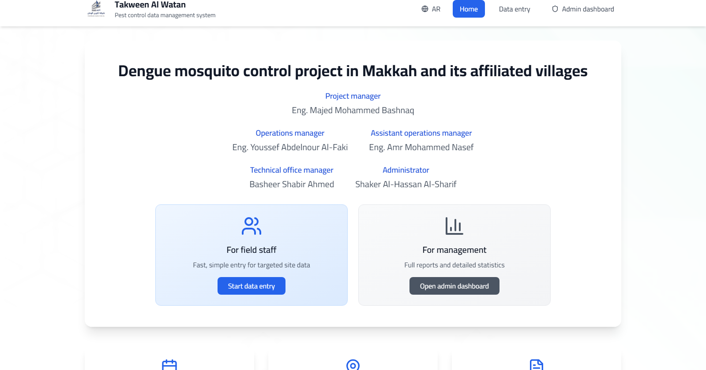
    </td>
    <td width="50%" valign="top">
      <strong>Field Data Entry</strong> 
      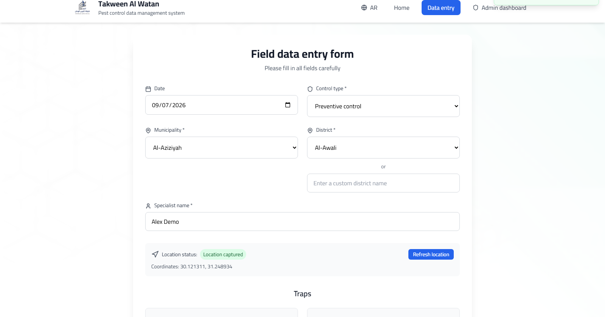
    </td>
  </tr>
  <tr>
    <td width="50%" valign="top">
      <strong>Target Sites</strong> 
      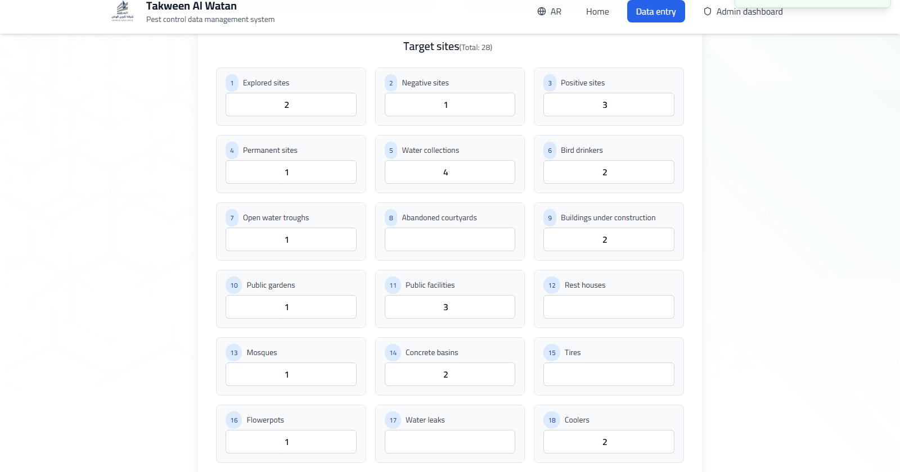
    </td>
    <td width="50%" valign="top">
      <strong>Confirm Save</strong> 
      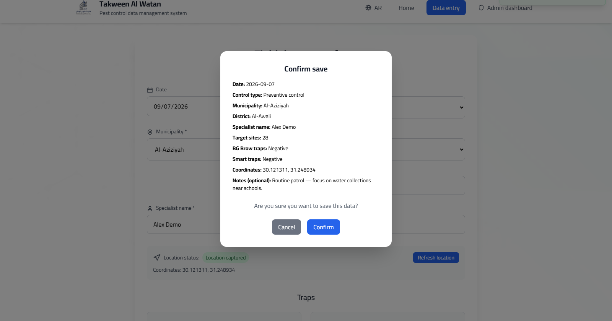
    </td>
  </tr>
  <tr>
    <td width="50%" valign="top">
      <strong>Admin Login</strong> 
      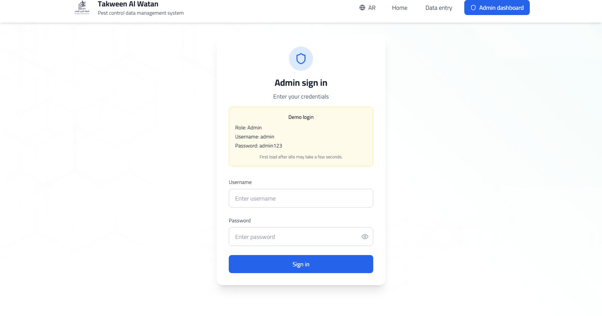
    </td>
    <td width="50%" valign="top">
      <strong>Admin Dashboard</strong> 
      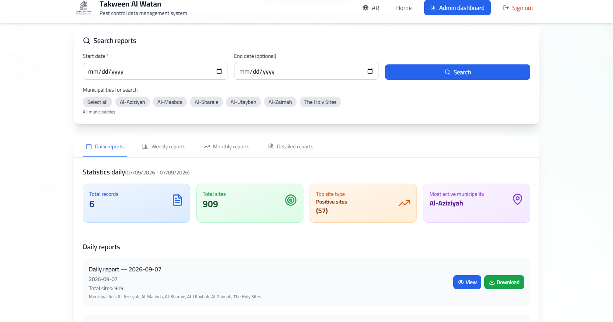
    </td>
  </tr>
  <tr>
    <td width="50%" valign="top">
      <strong>Weekly Report View</strong> 
      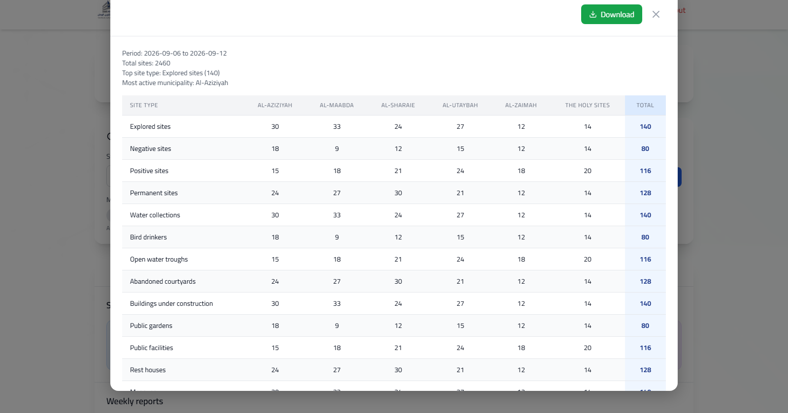
    </td>
    <td width="50%" valign="top">
      <strong>Weekly Excel Export</strong> 
      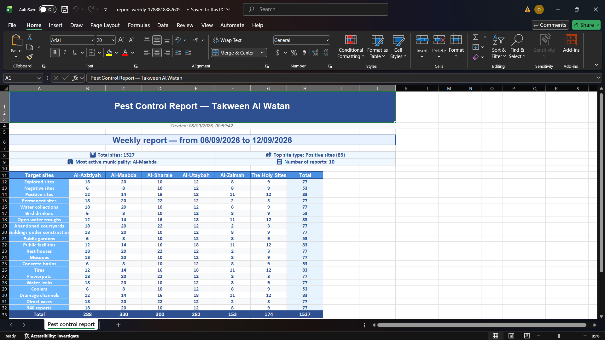
    </td>
  </tr>
  <tr>
    <td width="50%" valign="top">
      <strong>Detailed Report View</strong> 
      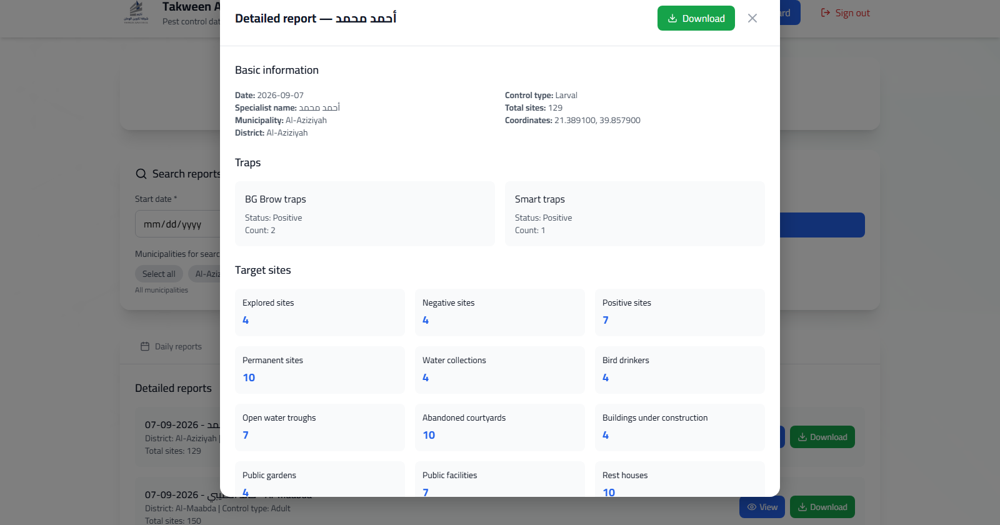
    </td>
    <td width="50%" valign="top">
      <strong>Detailed Excel Export</strong> 
      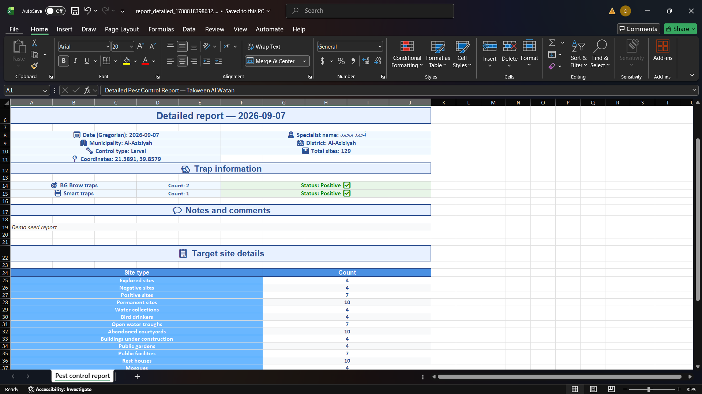
    </td>
  </tr>
  <tr>
    <td colspan="2" valign="top">
      <strong>Mobile Admin Dashboard</strong> 
      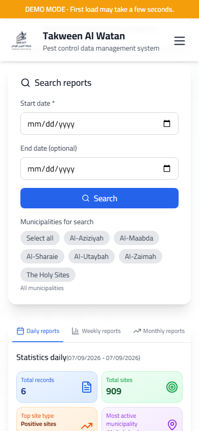
    </td>
  </tr>
</table>

---

## Live Demo 🚀

[**View Live Demo**](https://takween-al-watan-demo.vercel.app)

| Role  | Username | Password |
| ----- | -------- | -------- |
| Admin | admin    | admin123 |

Field workers use **Data entry** with no login.

---

## Author

👤 **Omar Mahmoud**
📧 [omrmhd54@gmail.com](mailto:omrmhd54@gmail.com)
💼 [LinkedIn](https://www.linkedin.com/in/omrmhd5/)
🌐 [Portfolio](https://omarmahmoud.dev/)
🔗 [GitHub](https://github.com/omrmhd5)
